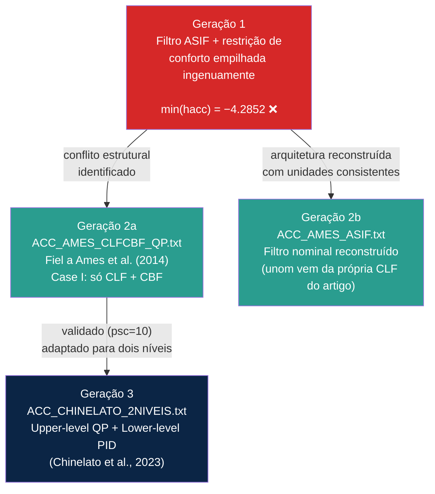
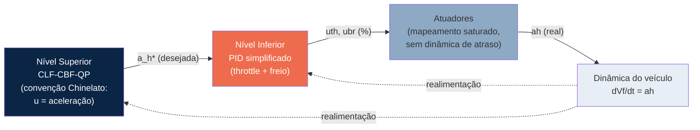
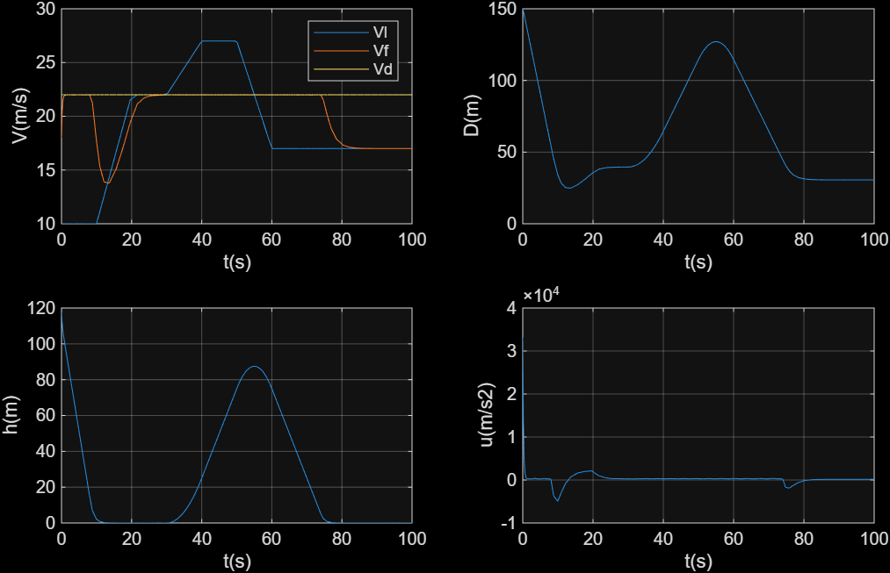
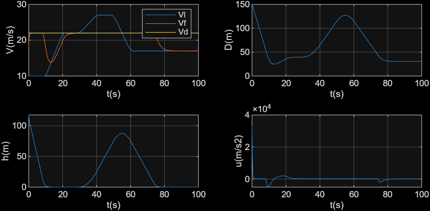
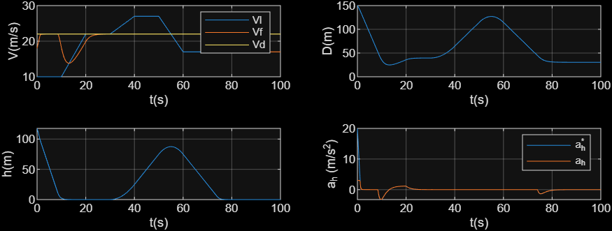
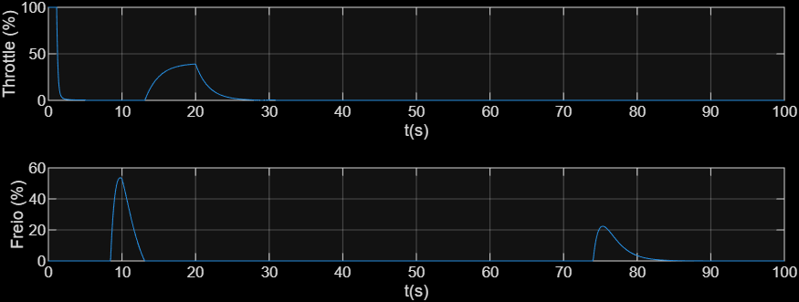

# Arquitetura da Simulação: Arquivos, Parâmetros e Sintonia

Este documento descreve a evolução completa da simulação do ACC — desde a primeira tentativa (arquitetura ASIF com conflito CBF×conforto) até a arquitetura de dois níveis final (Chinelato et al., 2023) — incluindo todo o processo de depuração numérica, as descobertas qualitativas sobre o comportamento das diferentes arquiteturas, e o dicionário completo de parâmetros.

## 1. Visão Geral: Três Gerações de Implementação

O projeto passou por três gerações de código, cada uma resolvendo um problema da anterior:



### Arquivos finais do projeto

| Arquivo | Papel | Status |
|---|---|---|
| `LIE_2026.m` | Dedução simbólica das derivadas de Lie (LfV, LgV, Lfh, Lgh) | Suporte / offline |
| `QPhild.m` | Resolve o QP via algoritmo de Hildreth | Usado por todos os `fcn` |
| `ACC_AMES_CLFCBF_QP.txt` | CLF-CBF-QP completo, fiel a Ames et al. (2014), Case I | ✅ Validado (`psc=10`) |
| `ACC_AMES_ASIF.txt` | Filtro Nominal + CBF (ASIF), mesma convenção de unidades | ✅ Validado |
| `ACC_CHINELATO_2NIVEIS.txt` | Arquitetura de dois níveis (upper QP + lower PID) | ⚠️ Validado com ressalva (ver Seção 4.3) |
| `ACC_TESTE_2026.slx` | Malha fechada Simulink — Integrators, Clock, Demux | Compartilhado pelos três `fcn` acima (trocando o conteúdo do bloco) |
| `INIT_ACC_2026.m` | Define `Vf0`, `D0`, roda `sim(...)`, plota resultados | Script principal |


## 2. CLF-CBF-QP vs. ASIF: Duas Filosofias de Controle

### 2.1 Comparação estrutural

| Aspecto | **CLF-CBF-QP completo** | **Filtro Nominal + CBF (ASIF)** |
|---|---|---|
| Variáveis de decisão do QP | `u` e `δ` (2) | Só `u` (1) |
| Restrições no QP | CLF (suave, com folga `δ`) + CBF (rígida) | Só CBF (rígida) |
| Como `Vd` é perseguido | Dentro do QP, como restrição CLF | Fora do QP — controlador nominal calculado antes |
| Graus de liberdade quando a CBF está ativa | 1 (via `δ`) — ainda tenta minimizar afastamento de `Vd` | 0 — `u` fica 100% determinado pela CBF |
| `Vd` influencia `u` quando a CBF está ativa? | Sim, parcialmente | **Não**, nenhuma influência |
| Nome na literatura | CLF-CBF-QP (Ames et al., 2014; 2017) | ASIF — Active Set Invariance Filter (Gurriet et al., 2018) |

```
CLF-CBF-QP completo:   [Objetivo de velocidade + Segurança]  →  QP  →  u*
Filtro ASIF:           [Objetivo de velocidade]  →  u_nom  →  [Segurança]  →  QP  →  u*
```

### 2.2 O controlador nominal do ASIF, em detalhe

```matlab
unom = -c*(m/2)*(Vf-Vd) + Fr;
```

Essa fórmula vem diretamente da Seção IV-A de Ames et al. (2014) — é o exemplo que o próprio artigo dá de um controlador que satisfaz a condição de CLF com igualdade (cancela o arrasto e adiciona realimentação proporcional). **Nenhuma variável de segurança (`xr`, `Vl`, `hacc`) aparece nessa fórmula** — o controlador nominal resolve *só* "chegar em `Vd`", cego para tudo o mais.

### 2.3 Comportamento qualitativo perto da fronteira (achado empírico)

Quando `hacc = xr - Td·Vf` fica pinada próxima de zero por um trecho prolongado, a restrição da CBF está ativa com igualdade continuamente. Como no ASIF isso consome a única variável de decisão disponível, dá para derivar exatamente o que acontece:

$$x_r(t) \approx T_d \cdot V_f(t) \quad \Rightarrow \quad \dot{x}_r \approx T_d \cdot \dot{V}_f$$

Como $\dot{x}_r = V_l - V_f$ é sempre verdade (equação de estado), substituindo:

$$\dot{V}_f \approx \frac{V_l - V_f}{T_d}$$

**Interpretação:** enquanto a CBF está ativa, o sistema deixa de perseguir `Vd` e passa a se comportar como um **filtro passa-baixa de primeira ordem seguindo o líder**, com constante de tempo `Td`. Esse comportamento de "colar no líder" — observado empiricamente nos gráficos (`Vf` acompanhando as acelerações de `Vl` perto da fronteira) — **emerge da matemática da restrição ativa**, sem que nenhum `if` explícito no código o programe.

O sistema alterna entre dois modos:
- **Longe da fronteira:** CBF inativa → `u = unom` → `Vf` persegue `Vd`
- **Perto da fronteira:** CBF ativa → `u` determinado só pela CBF → `Vf` persegue `Vl` (com atraso `Td`)

No CLF-CBF-QP completo, esse chaveamento é suavizado pela variável `δ`, que permite ao sistema "negociar" em vez de abandonar `Vd` por completo.


## 3. Histórico de Validação Numérica do `psc`

### 3.1 As quatro iterações

| # | Arquitetura | `psc` | `min(hacc)` | Causa / Conclusão |
|---|---|---|---|---|
| 1 | Filtro ASIF + restrição de conforto empilhada ingenuamente | — | **−4.2852** | Conflito estrutural: CBF de segurança e limite de força tornam-se simultaneamente inviáveis (ver Ames et al. 2017, Seção V-A-3) |
| 2 | CLF-CBF-QP completo | `100` | **−1.5738** | Hessiana do QP mal-condicionada: $H_{11}=2/m^2\approx7,3\times10^{-7}$ vs. $H_{22}=2p_{sc}=200$ — razão $\sim\!2,7\times10^{8}$ impede convergência do Hildreth em 38 iterações |
| 3 | CLF-CBF-QP completo, Tabela I do Ames et al. (2014) | `1e-5` | **3,10×10⁻¹⁰** ✅ | Hessiana bem condicionada, mas surge uma "zona preguiçosa": para erros de velocidade pequenos, o QP prefere relaxar a CLF (barato) a corrigir de verdade (caro) — ver Seção 3.2 |
| 4 | CLF-CBF-QP completo, `psc` ajustado ao cenário | **`10`** | **3,40×10⁻¹⁰** ✅ | Resolve os dois problemas simultaneamente: Hessiana ainda razoavelmente condicionada **e** zona preguiçosa praticamente eliminada — **valor recomendado** |

### 3.2 A "zona preguiçosa": por que `psc` pequeno demais atrapalha o desempenho

O QP compara, a cada instante, o custo de duas estratégias diante de um erro de velocidade $e = V_f - V_d$:

| Estratégia | Como o custo escala com `e` |
|---|---|
| Relaxar via `δ` (ignorar o erro) | $\propto p_{sc}\cdot e^4$ (quártico) |
| Corrigir via força `u` | $\propto e^2$ (quadrático) |

Para `e` pequeno, o termo quártico é menor que o quadrático (mesmo com `psc` moderado), então relaxar sai mais barato — o sistema "não liga" para erros pequenos. O ponto de equilíbrio aproximado entre as duas estratégias é:

$$e^{*} \approx \sqrt{\frac{1}{4 \cdot p_{sc}}}$$

| `psc` | `e*` aproximado | Efeito prático |
|---|---|---|
| `1e-5` | ≈ 158 m/s | Erro real (~4 m/s) nunca ultrapassa o limiar → sistema sempre relaxa, `Vf` mal se move |
| `10` | ≈ 0,16 m/s | Qualquer erro relevante já dispara correção real → rastreamento responsivo |
| `100` | ≈ 0,05 m/s | Rastreamento ainda mais agressivo, mas Hessiana malcondicionada trava o solver |

### 3.3 Achado teórico: `psc` como um "dial" contínuo entre as duas arquiteturas

Com `psc` grande, relaxar a CLF via `δ` fica caro para praticamente qualquer erro — a restrição CLF passa a se comportar como **quase rígida**, cada vez mais parecida com o controlador nominal do ASIF (que persegue `Vd` de forma incondicional). Por isso, o resultado com `psc=10` no CLF-CBF-QP ficou visualmente muito parecido com o ASIF.

**Conclusão:** o ASIF não é uma arquitetura fundamentalmente separada do CLF-CBF-QP — ele é, na prática, o **caso-limite do CLF-CBF-QP quando $p_{sc}\to\infty$** (a folga fica tão cara que nunca compensa usá-la). A diferença remanescente é que o CLF-CBF-QP **ainda tem a opção** de usar `δ` em situações extremas; o ASIF **nunca tem essa opção**, por construção.

$$p_{sc} \to 0 \quad\Longrightarrow\quad \text{zona preguiçosa, } V_d \text{ é ignorado facilmente}$$
$$p_{sc} \to \infty \quad\Longrightarrow\quad \text{CLF-CBF-QP} \to \text{ASIF}$$

Essa é uma contribuição analítica que emergiu da investigação empírica deste projeto — vale destacá-la na seção de discussão do TG.


## 4. Arquitetura de Dois Níveis (Chinelato et al., 2023)

### 4.1 Estrutura



### 4.2 Diferenças-chave em relação aos arquivos Ames-puros

- **Convenção de unidades:** `u` volta a ser **aceleração** (não força), igual ao modelo de Chinelato — `g_acc=[1;0]`, `Hacc = 2*[1, 0; 0, pdacc]` (sem o fator `1/m²`).
- **Saída do nível superior:** `a_h* = uacc − Fr/m` — não é mais aplicado diretamente à planta.
- **Nível inferior novo:** PID simplificado (escolha do autor: sem dinâmica de atuador separada) convertendo `a_h*` em comandos de throttle/freio (`uth`, `ubr`, 0–100%), usando `persistent` para dar memória ao termo integral do PID dentro do bloco MATLAB Function.
- **A planta recebe `ah` (real, pós-atuador), não `a_h*`** — essa é a mudança estrutural mais importante.

### 4.3 Achado crítico: a garantia formal de segurança não é herdada automaticamente

```
[hmin, idx] = min(hacc)  →  −0.0053 em t = 10.36s
```

A prova de invariância da CBF (usada em todos os testes anteriores) assume que o `u` calculado pelo QP é **exatamente** o que é aplicado à planta. Na arquitetura de dois níveis, isso deixa de ser verdade: a planta recebe `ah`, o resultado de um mapeamento saturado (`a_th_max=3 m/s²`, `a_br_max=6 m/s²`) que pode divergir de `a_h*` — e diverge, sobretudo em `t≈0`, quando `a_h*` dispara para ~20 m/s² (nenhuma restrição de conforto existe dentro do QP para conter esse pedido) e a saturação do throttle não consegue acompanhar a tempo.

**Resultado:** uma violação pequena (`−0.0053`, ~300× menor que o caso malcondicionado `psc=100`), mas **não-nula** — prova empírica de que:
1. A garantia formal do nível superior é uma propriedade *daquele nível isolado*, não do sistema completo;
2. Introduzir um nível inferior com limitações físicas reais **quebra o elo** entre a prova teórica e o comportamento simulado, exigindo reverificação empírica;
3. Isso reforça por que Ames et al. (2017, Seção III) tratam explicitamente do caso de restrições de atuação (`h_F`) — sem isso, mesmo um sistema teoricamente seguro no papel pode falhar quando confrontado com limites físicos reais de atuadores.

### 4.4 Nota de implementação: `persistent` exige tempo de amostragem discreto

Blocos MATLAB Function com tempo de amostragem **contínuo** (herdado do resto do modelo) não podem usar `persistent` — solvers de passo variável chamam a função múltiplas vezes por passo (estágios intermediários), o que corromperia a memória do PID. Correção: configurar o **Sample Time** do bloco para um valor discreto fixo (`0.02`, mesmo valor do `Ts` usado no cálculo do termo integral).


## 5. Dicionário de Parâmetros (consolidado)

### 5.1 Parâmetros de projeto do nível superior (QP)

| Símbolo | Significado | Valor recomendado | Observação |
|---|---|---|---|
| $V_d$ | Velocidade de cruzeiro desejada | 22 m/s | Escolha do autor (artigo usa 24) |
| $T_d$ | Time headway | 1.8 s | Igual ao artigo |
| $c$ | Taxa de convergência da CLF | 10 | Igual ao artigo |
| $\lambda$ (≡ $\gamma$) | Agressividade da CBF na fronteira | 1 | Igual ao artigo |
| $p_{sc}$ (≡ `pdacc`) | Peso da folga `δ` | **10** | Ajustado empiricamente para este cenário (ver Seção 3) |

### 5.2 Parâmetros físicos do veículo

| Símbolo | Valor | Descrição |
|---|---|---|
| $m$ | 1650 kg | Massa do veículo hospedeiro |
| $f_0, f_1, f_2$ | 0.1, 5, 0.25 | Coeficientes do arrasto aerodinâmico |

### 5.3 Parâmetros do nível inferior (PID, arquitetura de dois níveis)

| Símbolo | Valor | Descrição |
|---|---|---|
| `a_th_max` | 3.0 m/s² | Aceleração máxima via acelerador |
| `a_br_max` | 6.0 m/s² | Desaceleração máxima via freio |
| `Kp_th, Ki_th, Kd_th` | 0.6, 0.05, 0.02 | Ganhos PID do throttle |
| `Kp_br, Ki_br, Kd_br` | 0.6, 0.05, 0.02 | Ganhos PID do freio |
| `Ts` | 0.02 s | Período de amostragem do bloco discreto |

### 5.4 Condições iniciais e simulação

| Símbolo | Valor | Observação |
|---|---|---|
| $V_{f0}$ | 18 m/s | Definido em `INIT_ACC_2026.m` |
| $D_0$ | 150 m | Definido em `INIT_ACC_2026.m` |
| `tspan` | [0, 100] s | Necessário para cobrir todo o perfil do líder |


## 6. Como Cada Parâmetro Afeta a Performance

- **`Vd` ↑** → maior erro médio quando o líder é mais lento → CBF intervém com mais frequência.
- **`Td` ↑** → conjunto seguro maior, sistema mais conservador (mantém mais distância); **`Td` ↓** → segue mais próximo, mas exige desacelerações mais fortes para preservar `h(x)≥0`.
- **`lambda` ↑** → tolera se aproximar mais da fronteira antes de reagir (mais eficiente, menos margem numérica); **↓** → reage mais cedo, mais conservador.
- **`psc` (`pdacc`) ↑** → CLF cada vez mais rígida, comportamento se aproxima do ASIF; **↓ demais** → zona preguiçosa (ver Seção 3.2); **valor equilibrado (`≈10`)** → resolve ambos.
- **Limites de atuador (`a_th_max`, `a_br_max`) ↓** (mais restritivos) → maior risco da violação descrita na Seção 4.3, já que o gap entre `a_h*` (irrestrito) e `ah` (saturado) cresce.
- **`Vf0`, `D0`** → não são parâmetros de sintonia, mas definem o ponto de partida em relação à fronteira do conjunto seguro; início muito próximo da borda intensifica transientes de frenagem.


## 7. Tabela-Resumo: "O que mexer para..."

| Quero que o sistema... | Parâmetro a ajustar | Direção |
|---|---|---|
| Converja mais rápido para `Vd`, sem zona preguiçosa | `psc` (`pdacc`) | Aumentar (mas cuidado com mal-condicionamento acima de ~50-100) |
| Siga mais próximo do líder | `Td` | Diminuir (com cautela) |
| Seja mais conservador na fronteira segura | `lambda` | Diminuir |
| Se comporte mais como o ASIF (perseguição "tudo ou nada") | `psc` | Aumentar bastante (→∞) |
| Reduza a violação de segurança do nível inferior (Seção 4.3) | `a_th_max`, `a_br_max` (aumentar) ou adicionar restrição de conforto no QP superior | Ajustar limites físicos ou implementar `h_F` |
| Teste apenas o comportamento nominal, sem segurança (ASIF) | `cbfacc_ativ` | Definir `0` |


## 8. Resultados Visuais das Simulações

As imagens abaixo foram geradas no MATLAB/Simulink a partir de `INIT_ACC_2026.m`, uma para cada arquitetura validada. Os caminhos usados (`img/...`) assumem que este arquivo fica em `docs/` e as imagens em `docs/img/` — ajuste os caminhos se a estrutura do seu repositório for diferente. **Para inserir suas próprias imagens**, basta salvar o `.png` gerado pelo MATLAB (`saveas(figure(1), 'img/nome_do_arquivo.png')`, ou exportar manualmente) substituindo os arquivos indicados abaixo, mantendo os mesmos nomes — ou trocando o caminho no ``.

### 8.1 ASIF — Filtro Nominal + CBF



*Vf0=18 m/s, D0=150 m, Vd=22 m/s, Td=1.8 s.* Repare no gráfico `h(m)`: a barreira fica "grudada" em zero por dois trechos prolongados (t≈10–20s e t≈75–80s) — a assinatura visual do comportamento derivado na Seção 2.3: enquanto a CBF está ativa, `Vf` deixa de perseguir `Vd` e passa a acompanhar `Vl` com atraso `Td`. Fora desses trechos, `Vf` persegue `Vd` livremente. `min(hacc) = 3.04×10⁻¹⁰` (validado, sem violação).


### 8.2 CLF-CBF-QP completo (`psc = 10`)



*Mesmas condições iniciais do ASIF.* Comparado à Seção 8.1, o comportamento é visualmente parecido — consistente com a descoberta da Seção 3.3 (`psc` grande aproxima o CLF-CBF-QP do caso-limite ASIF). A diferença fica no grau de liberdade extra (`δ`): mesmo com a CBF ativa, o sistema ainda tenta minimizar o afastamento de `Vd`. `min(hacc) = 3.40×10⁻¹⁰` (validado, sem violação) — este é o valor de `psc` recomendado (Seção 3.1, iteração 4).

### 8.3 Arquitetura de Dois Níveis (Chinelato et al., 2023)


<p>


*Mesmas condições iniciais.* O primeiro gráfico mostra `a_h^*` (desejado pelo nível superior) disparando para ~20 m/s² em `t≈0` — muito acima da capacidade física dos atuadores (`a_th_max=3`, `a_br_max=6`) — enquanto `a_h` (real, pós-saturação) permanece contido. O segundo gráfico mostra `uth`/`ubr` nunca ativos simultaneamente, com o freio reagindo exatamente nos instantes de pressão da CBF (t≈10s e t≈75s, coincidindo com os vales de `h(m)` do gráfico principal). Esta é a arquitetura que revelou o achado da Seção 4.3: `min(hacc) = −0.0053` em `t=10.36s` — uma violação pequena, mas real, causada pela saturação do nível inferior não estar contemplada na prova formal do nível superior.


## 9. Referências

- AMES, A. D.; GRIZZLE, J. W.; TABUADA, P. *Control barrier function based quadratic programs with application to adaptive cruise control*. IEEE CDC, 2014.
- AMES, A. D.; XU, X.; GRIZZLE, J. W.; TABUADA, P. *Control barrier function based quadratic programs for safety critical systems*. IEEE TAC, 62(8), 2017.
- AMES, A. D.; COOGAN, S.; EGERSTEDT, M.; NOTOMISTA, G.; SREENATH, K.; TABUADA, P. *Control barrier functions: Theory and applications*. European Control Conference (ECC), 2019.
- GURRIET, T.; SINGLETARY, A.; REHER, J.; CIARLETTA, L.; FERON, E.; AMES, A. D. *Towards a framework for realizable safety critical control through active set invariance*. ICCPS, 2018. — fonte da arquitetura ASIF.
- CHINELATO, C. I. G.; ANGÉLICO, B. A.; JUSTO, J. F.; LAGANÁ, A. A. M. *Design of adaptive cruise control with control barrier function and model-free control*. Journal of Control, Automation and Electrical Systems, 34, 2023. — fonte da arquitetura de dois níveis.
